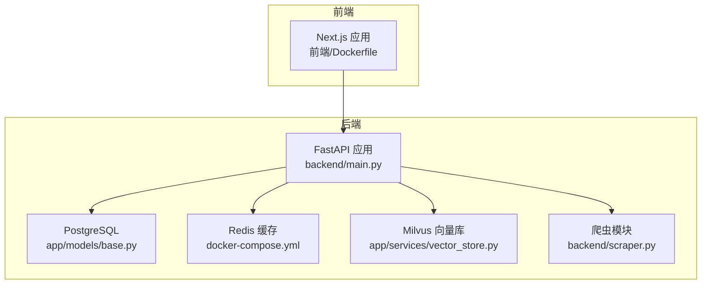
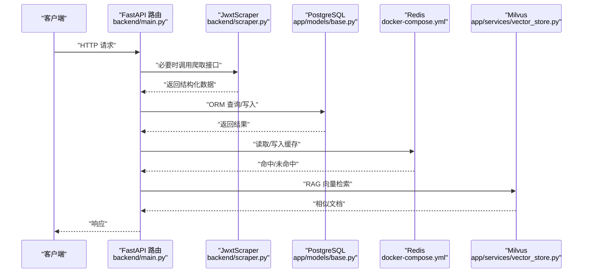
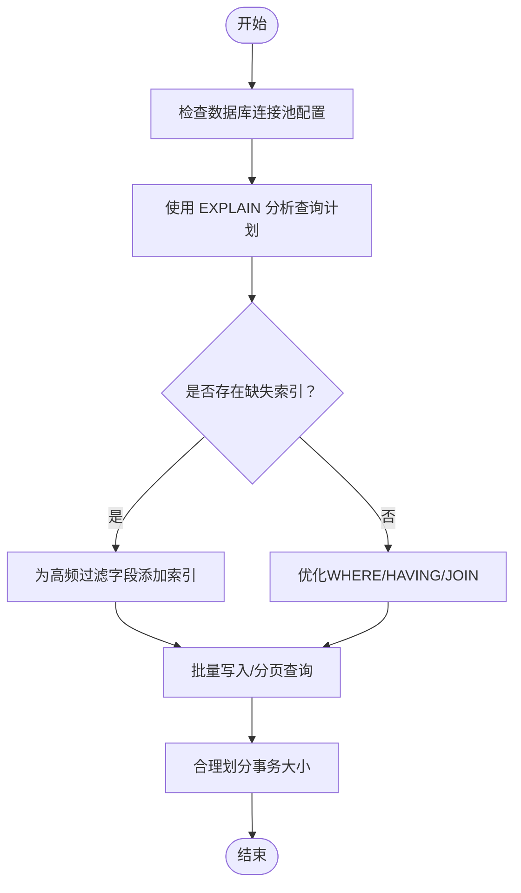
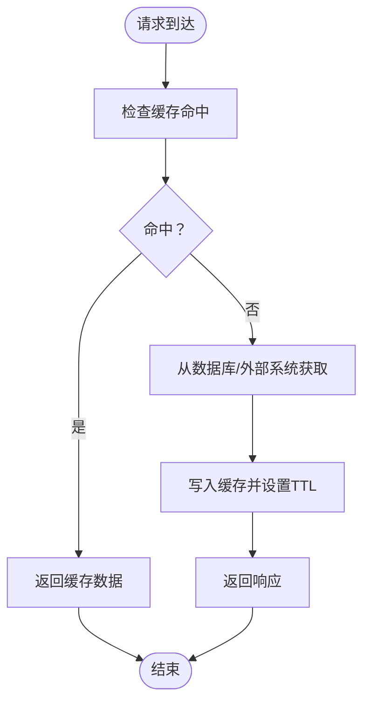
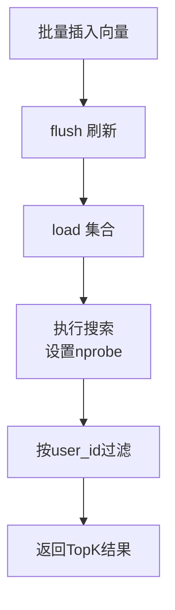
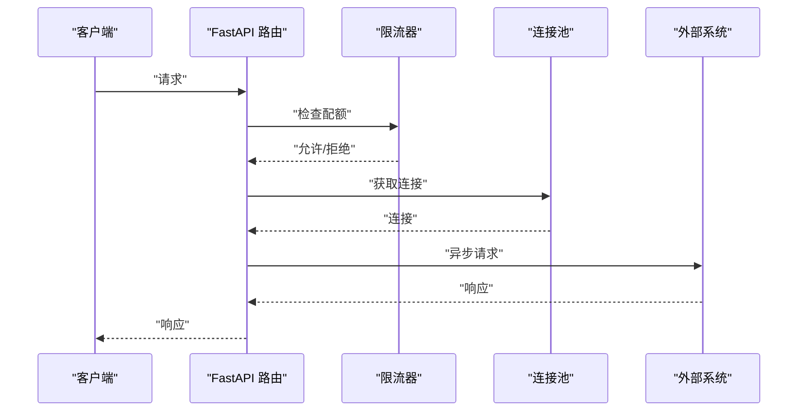
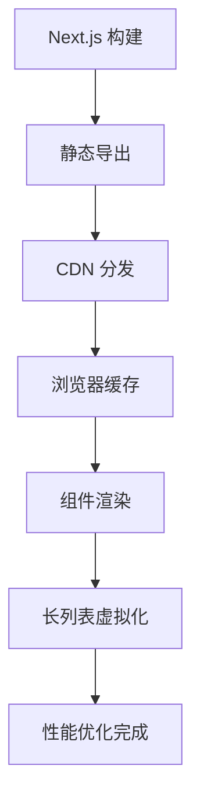
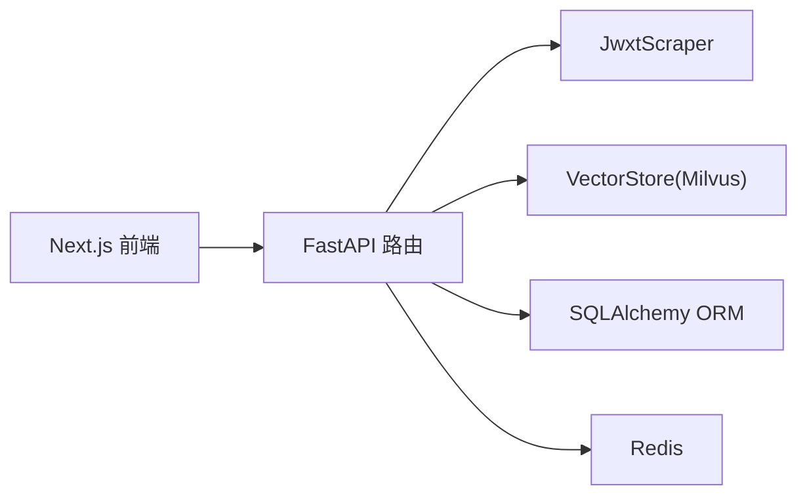

# 性能优化

<cite>
**本文引用的文件**
- [backend/main.py](file://backend/main.py)
- [backend/app/api/chat.py](file://backend/app/api/chat.py)
- [backend/app/api/education.py](file://backend/app/api/education.py)
- [backend/app/services/vector_store.py](file://backend/app/services/vector_store.py)
- [backend/scraper.py](file://backend/scraper.py)
- [backend/app/models/base.py](file://backend/app/models/base.py)
- [backend/app/models/conversation.py](file://backend/app/models/conversation.py)
- [backend/app/models/education_data.py](file://backend/app/models/education_data.py)
- [backend/requirements.txt](file://backend/requirements.txt)
- [frontend/package.json](file://frontend/package.json)
- [frontend/next.config.ts](file://frontend/next.config.ts)
- [docker-compose.yml](file://docker-compose.yml)
- [backend/test_login.py](file://backend/test_login.py)
- [backend/test_scraper.py](file://backend/test_scraper.py)
</cite>

## 目录
1. [简介](#简介)
2. [项目结构](#项目结构)
3. [核心组件](#核心组件)
4. [架构总览](#架构总览)
5. [详细组件分析](#详细组件分析)
6. [依赖分析](#依赖分析)
7. [性能考虑](#性能考虑)
8. [故障排查指南](#故障排查指南)
9. [结论](#结论)
10. [附录](#附录)

## 简介
本指南面向“智能教务系统AI助手”项目的性能优化，围绕数据库查询、缓存、向量数据库、API、前端以及性能测试方法给出系统性的优化策略与实操建议。内容基于仓库现有代码与容器编排配置，结合FastAPI、PostgreSQL、Redis、Milvus、Next.js等技术栈，提供可落地的优化路径。

## 项目结构
后端采用FastAPI + SQLAlchemy + Pydantic，前端采用Next.js，服务通过Docker Compose编排，包含PostgreSQL、Redis、Etcd、MinIO、Milvus等基础设施。

图表来源
- [docker-compose.yml:1-148](file://docker-compose.yml#L1-L148)
- [backend/main.py:1-853](file://backend/main.py#L1-L853)
- [backend/app/models/base.py:1-29](file://backend/app/models/base.py#L1-L29)
- [backend/app/services/vector_store.py:1-164](file://backend/app/services/vector_store.py#L1-L164)
- [backend/scraper.py:1-1220](file://backend/scraper.py#L1-L1220)

章节来源
- [docker-compose.yml:1-148](file://docker-compose.yml#L1-L148)
- [backend/main.py:1-853](file://backend/main.py#L1-L853)
- [backend/app/models/base.py:1-29](file://backend/app/models/base.py#L1-L29)

## 核心组件
- API层：提供健康检查、验证码、登录、个人信息、成绩、课表、培养方案、学业进度、考试安排、教师/课程查询、AI对话、选项查询等接口。
- 数据模型：用户、对话、消息、教育数据、成绩、课程等，使用SQLAlchemy ORM映射。
- 爬虫模块：封装对教务系统的HTTP请求、验证码获取、登录、各类数据抓取与解析。
- 向量存储：基于Milvus的向量检索服务，支持集合创建、文档插入、相似度搜索、按用户删除。
- 缓存：Redis作为外部缓存（requirements中引入），可用于会话、验证码、RAG上下文等缓存。
- 前端：Next.js应用，支持静态导出与远程图片模式配置。

章节来源
- [backend/main.py:95-800](file://backend/main.py#L95-L800)
- [backend/app/models/conversation.py:1-42](file://backend/app/models/conversation.py#L1-L42)
- [backend/app/models/education_data.py:1-103](file://backend/app/models/education_data.py#L1-L103)
- [backend/scraper.py:1-1220](file://backend/scraper.py#L1-L1220)
- [backend/app/services/vector_store.py:1-164](file://backend/app/services/vector_store.py#L1-L164)
- [backend/requirements.txt:1-44](file://backend/requirements.txt#L1-L44)
- [frontend/next.config.ts:1-21](file://frontend/next.config.ts#L1-L21)

## 架构总览
下图展示请求在系统中的流转：前端发起请求，后端API处理业务逻辑，必要时调用爬虫模块访问教务系统，读写PostgreSQL与Redis，向量检索通过Milvus完成。

图表来源
- [backend/main.py:135-800](file://backend/main.py#L135-L800)
- [backend/scraper.py:1-1220](file://backend/scraper.py#L1-L1220)
- [backend/app/models/base.py:1-29](file://backend/app/models/base.py#L1-L29)
- [backend/app/services/vector_store.py:1-164](file://backend/app/services/vector_store.py#L1-L164)
- [docker-compose.yml:1-148](file://docker-compose.yml#L1-L148)

## 详细组件分析

### 数据库查询优化策略
- 连接与会话管理
  - 使用SQLAlchemy引擎与SessionLocal统一管理连接，避免重复创建连接带来的开销。
  - 在依赖注入中正确关闭会话，防止连接泄漏。
- 索引设计
  - 用户表、教育数据表、成绩/课程明细表均设置主键与常用查询字段索引（如user_id、course_code等）。
  - 建议对高频过滤字段（如user_id、semester、course_name）建立复合索引以提升查询效率。
- 查询计划分析
  - 使用EXPLAIN/EXPLAIN ANALYZE分析慢查询，定位全表扫描与缺失索引。
  - 避免SELECT *，仅返回必要字段；对大结果集分页查询。
- 连接池配置
  - 在生产环境配置合适的最大连接数、空闲连接数、连接超时与生命周期，降低连接争用与延迟。
- 事务与批量操作
  - 批量插入/更新使用bulk操作减少往返次数；合理拆分事务大小，避免长时间锁持有。

图表来源
- [backend/app/models/base.py:1-29](file://backend/app/models/base.py#L1-L29)
- [backend/app/models/education_data.py:1-103](file://backend/app/models/education_data.py#L1-L103)

章节来源
- [backend/app/models/base.py:1-29](file://backend/app/models/base.py#L1-L29)
- [backend/app/models/education_data.py:1-103](file://backend/app/models/education_data.py#L1-L103)

### 缓存策略优化（Redis）
- 命中率提升
  - 对高频读取数据（验证码、登录态、选项数据、RAG上下文）进行缓存。
  - 使用合理的TTL与热点数据预热，避免缓存雪崩与击穿。
  - 对不同业务场景区分缓存键空间，避免键冲突与污染。
- 失效策略
  - 采用写后失效（Write-Through/Write-Behind）或读后失效（Lazy Expiration）策略。
  - 对于用户会话与验证码，严格设置过期时间并清理过期键。
  - 对于RAG检索结果，结合用户权限与数据变更事件触发失效。
- 容量与持久化
  - 配置内存上限与淘汰策略（如LRU），开启AOF/RDB持久化保障可靠性。
  - 监控内存使用与命中率，动态调整TTL与容量。

图表来源
- [backend/requirements.txt:19-21](file://backend/requirements.txt#L19-L21)
- [docker-compose.yml:20-34](file://docker-compose.yml#L20-L34)

章节来源
- [backend/requirements.txt:19-21](file://backend/requirements.txt#L19-L21)
- [docker-compose.yml:20-34](file://docker-compose.yml#L20-L34)

### 向量数据库性能调优（Milvus）
- 集合与索引
  - 已创建集合并使用COSINE度量与IVF_FLAT索引，nlist参数控制倒排表数量。
  - 建议根据数据规模与查询延迟目标调整nlist与nprobe参数。
- 搜索参数
  - nprobe越大召回率越高但延迟上升，需在准确率与性能间权衡。
  - 支持按user_id过滤，保证数据隔离与查询范围收敛。
- 写入与加载
  - 写入后flush，加载集合后再搜索，避免未加载导致的查询失败。
  - 批量插入时控制批次大小，平衡吞吐与延迟。
- 数据生命周期
  - 按用户维度删除数据，定期清理无效向量，保持索引紧凑。

图表来源
- [backend/app/services/vector_store.py:37-164](file://backend/app/services/vector_store.py#L37-L164)

章节来源
- [backend/app/services/vector_store.py:1-164](file://backend/app/services/vector_store.py#L1-L164)

### API性能优化技巧
- 异步处理
  - 对外部系统调用（如教务系统）使用异步HTTP客户端，减少阻塞等待。
  - 对非关键路径（如日志、指标上报）采用后台任务队列。
- 并发控制
  - 使用连接池与限流器控制并发请求，避免上游系统过载。
  - 对爬取接口设置合理的超时与重试策略。
- 请求限流
  - 基于IP/用户维度实施速率限制，保护后端与上游系统。
- 响应优化
  - 对大对象分页返回，避免一次性传输过多数据。
  - 对只读接口启用缓存中间件，减少重复计算。

图表来源
- [backend/main.py:135-800](file://backend/main.py#L135-L800)
- [backend/scraper.py:1-1220](file://backend/scraper.py#L1-L1220)

章节来源
- [backend/main.py:1-853](file://backend/main.py#L1-L853)
- [backend/scraper.py:1-1220](file://backend/scraper.py#L1-L1220)

### 前端性能优化
- 静态资源压缩与CDN
  - 使用Next.js默认的构建优化与静态导出，配合CDN分发图片与静态资源。
  - 配置remotePatterns允许安全的远程图片加载。
- 渲染性能
  - 合理拆分组件，使用Suspense与懒加载减少首屏阻塞。
  - 对长列表使用虚拟化（如React Window）提升滚动性能。
- 缓存与预加载
  - 对不常变化的API结果进行浏览器缓存与Service Worker离线缓存。
  - 预加载关键路由与字体资源，缩短白屏时间。

图表来源
- [frontend/next.config.ts:1-21](file://frontend/next.config.ts#L1-L21)
- [frontend/package.json:1-92](file://frontend/package.json#L1-L92)

章节来源
- [frontend/next.config.ts:1-21](file://frontend/next.config.ts#L1-L21)
- [frontend/package.json:1-92](file://frontend/package.json#L1-L92)

## 依赖分析
- 外部依赖
  - FastAPI、Uvicorn：Web框架与ASGI服务器。
  - Requests、aiohttp：HTTP客户端，支持同步与异步请求。
  - BeautifulSoup、lxml：HTML解析与加速解析。
  - Redis：缓存与会话存储。
  - Milvus：向量数据库。
  - LangChain、OpenAI、DashScope：AI能力集成。
  - PostgreSQL驱动：数据库访问。
- 组件耦合
  - API层依赖爬虫模块与向量存储服务，同时与数据库模型交互。
  - 向量存储服务依赖Milvus SDK，数据库服务依赖SQLAlchemy。
  - 前后端通过REST API通信，前端通过Next.js静态导出部署。

图表来源
- [backend/main.py:1-853](file://backend/main.py#L1-L853)
- [backend/scraper.py:1-1220](file://backend/scraper.py#L1-L1220)
- [backend/app/services/vector_store.py:1-164](file://backend/app/services/vector_store.py#L1-L164)
- [backend/app/models/base.py:1-29](file://backend/app/models/base.py#L1-L29)
- [backend/requirements.txt:1-44](file://backend/requirements.txt#L1-L44)
- [frontend/package.json:1-92](file://frontend/package.json#L1-L92)

章节来源
- [backend/requirements.txt:1-44](file://backend/requirements.txt#L1-L44)
- [frontend/package.json:1-92](file://frontend/package.json#L1-L92)

## 性能考虑
- 数据库
  - 索引覆盖常见过滤字段；避免SELECT *；使用LIMIT与分页。
  - 连接池参数与事务拆分，降低锁竞争。
- 缓存
  - TTL策略与预热；热点数据隔离；监控命中率与内存使用。
- 向量检索
  - nlist与nprobe权衡；按用户过滤；批量写入与flush。
- API
  - 异步I/O；并发限制；超时与重试；响应裁剪。
- 前端
  - 静态导出与CDN；组件懒加载；虚拟化；浏览器缓存。

## 故障排查指南
- 登录与验证码
  - 使用测试脚本验证验证码获取与登录流程，确认服务器可达性与Cookie传递。
- 爬虫稳定性
  - 检查User-Agent、超时与重试策略；对HTML结构变化进行适配。
- 数据库连接
  - 检查连接字符串、网络连通性与健康检查；监控慢查询与连接数峰值。
- 向量库健康
  - 检查Milvus服务健康状态、集合是否存在、索引是否创建成功。
- 前端构建
  - 确认静态导出配置与远程图片模式；检查Next.js版本兼容性。

章节来源
- [backend/test_login.py:1-152](file://backend/test_login.py#L1-L152)
- [backend/test_scraper.py:1-280](file://backend/test_scraper.py#L1-L280)
- [docker-compose.yml:1-148](file://docker-compose.yml#L1-L148)

## 结论
通过数据库索引与连接池优化、Redis缓存策略、Milvus索引与查询参数调优、API异步与限流、前端静态导出与CDN配置，可显著提升系统整体性能与用户体验。建议在生产环境中持续监控关键指标（QPS、P95/P99延迟、缓存命中率、数据库慢查询、Milvus查询耗时），并基于实际负载进行参数微调。

## 附录
- 性能测试方法
  - 使用wrk/JMeter进行接口压测，关注并发数、吞吐量与延迟分布。
  - 使用pg_stat_statements分析慢查询，定位瓶颈。
  - 使用Milvus官方监控与日志分析查询耗时与索引效果。
- 基准测试工具
  - 数据库：pgbench、sysbench。
  - 缓存：redis-benchmark。
  - 向量检索：自定义批量查询脚本，评估不同nprobe下的延迟与精度。