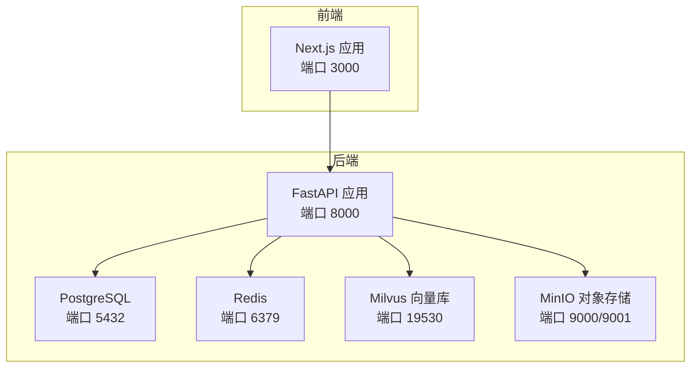
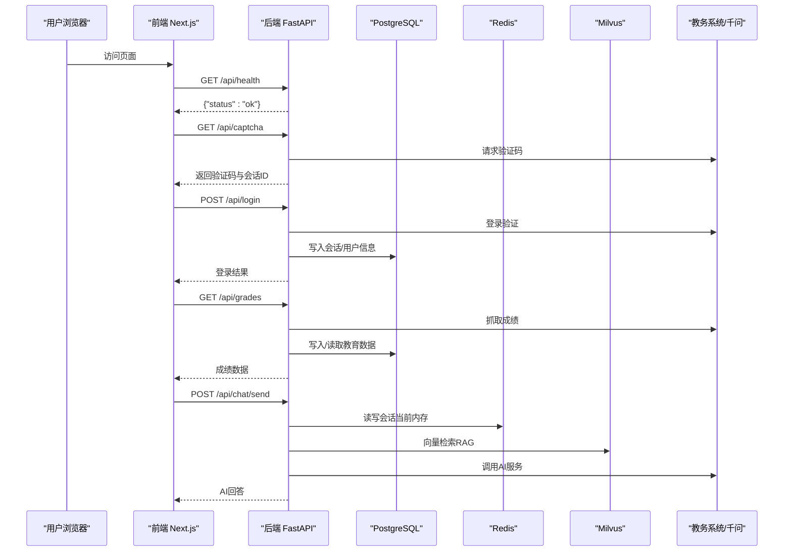
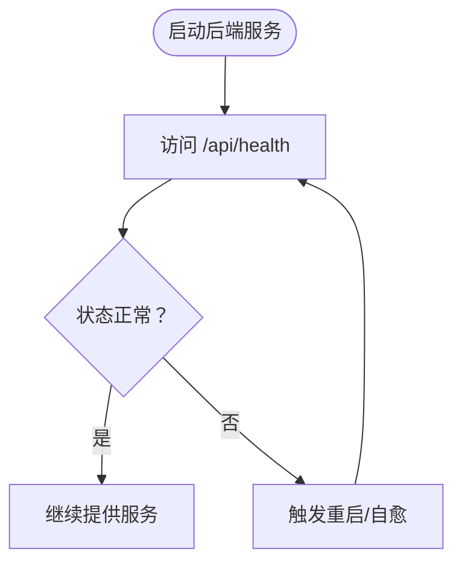
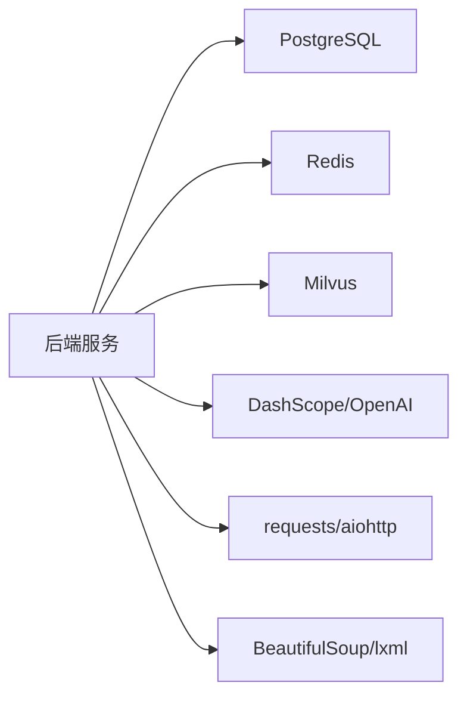

# 监控与日志管理

<cite>
**本文档引用的文件**
- [backend/main.py](file://backend/main.py)
- [backend/app/api/chat.py](file://backend/app/api/chat.py)
- [backend/app/api/education.py](file://backend/app/api/education.py)
- [backend/scraper.py](file://backend/scraper.py)
- [backend/app/models/base.py](file://backend/app/models/base.py)
- [backend/app/models/conversation.py](file://backend/app/models/conversation.py)
- [backend/app/models/education_data.py](file://backend/app/models/education_data.py)
- [backend/app/services/vector_store.py](file://backend/app/services/vector_store.py)
- [docker-compose.yml](file://docker-compose.yml)
- [backend/requirements.txt](file://backend/requirements.txt)
- [scripts/start.sh](file://scripts/start.sh)
- [src/server.ts](file://src/server.ts)
</cite>

## 目录
1. [简介](#简介)
2. [项目结构](#项目结构)
3. [核心组件](#核心组件)
4. [架构总览](#架构总览)
5. [详细组件分析](#详细组件分析)
6. [依赖分析](#依赖分析)
7. [性能考虑](#性能考虑)
8. [故障排查指南](#故障排查指南)
9. [结论](#结论)
10. [附录](#附录)

## 简介
本文件面向“智能教务系统AI助手”项目的监控与日志管理，目标是帮助运维与开发团队建立完善的可观测性体系，覆盖应用性能监控（APM）、日志采集与分析、健康检查与自动恢复、第三方监控工具集成（Prometheus/Grafana/ELK）、告警规则与通知机制，以及故障诊断与性能瓶颈定位方法。文档以仓库现有实现为基础，结合最佳实践给出可操作的建议与图示。

## 项目结构
项目采用前后端分离与多服务编排的架构：
- 后端FastAPI服务负责API路由、业务逻辑、数据库与外部系统交互
- 前端Next.js服务提供Web界面
- Docker Compose编排数据库（PostgreSQL）、缓存（Redis）、向量数据库（Milvus）、对象存储（MinIO）等依赖服务
- 日志与健康检查在现有代码基础上进行扩展即可满足需求

图表来源
- [docker-compose.yml:1-148](file://docker-compose.yml#L1-L148)
- [backend/main.py:94-129](file://backend/main.py#L94-L129)

章节来源
- [docker-compose.yml:1-148](file://docker-compose.yml#L1-L148)
- [backend/main.py:94-129](file://backend/main.py#L94-L129)

## 核心组件
- 应用层（FastAPI后端）
  - 健康检查端点：/api/health
  - 业务API：验证码、登录、个人信息、成绩、课表、教师/课程查询、AI对话等
  - 日志：全局INFO级别日志，关键路径带上下文信息
- 数据层
  - PostgreSQL：用户、对话、消息、教育数据等模型
  - Redis：会话与缓存（当前实现使用内存字典，生产建议替换为Redis）
  - Milvus：向量检索（RAG）
- 外部系统
  - 教务系统（爬虫模块对接）
  - 千问（DashScope/OpenAI）：AI对话与嵌入生成
- 健康检查
  - Docker Compose对数据库、缓存、向量库、对象存储分别定义了健康检查

章节来源
- [backend/main.py:126-129](file://backend/main.py#L126-L129)
- [backend/app/models/base.py:10-28](file://backend/app/models/base.py#L10-L28)
- [backend/app/models/conversation.py:11-42](file://backend/app/models/conversation.py#L11-L42)
- [backend/app/models/education_data.py:11-47](file://backend/app/models/education_data.py#L11-L47)
- [docker-compose.yml:14-18](file://docker-compose.yml#L14-L18)
- [docker-compose.yml:29-33](file://docker-compose.yml#L29-L33)
- [docker-compose.yml:88-92](file://docker-compose.yml#L88-L92)
- [docker-compose.yml:66-70](file://docker-compose.yml#L66-L70)

## 架构总览
下图展示从浏览器到后端、数据库与外部系统的调用链路，并标注可观测性关注点（日志、健康检查、外部依赖）。

图表来源
- [backend/main.py:135-189](file://backend/main.py#L135-L189)
- [backend/main.py:192-327](file://backend/main.py#L192-L327)
- [backend/main.py:398-437](file://backend/main.py#L398-L437)
- [backend/app/api/chat.py:45-153](file://backend/app/api/chat.py#L45-L153)
- [backend/app/api/education.py:52-77](file://backend/app/api/education.py#L52-L77)
- [backend/scraper.py:22-60](file://backend/scraper.py#L22-L60)
- [backend/app/services/vector_store.py:100-141](file://backend/app/services/vector_store.py#L100-L141)
- [docker-compose.yml:107-136](file://docker-compose.yml#L107-L136)

## 详细组件分析

### 健康检查与自动重启
- 后端健康检查端点：/api/health，返回服务可用状态
- Docker Compose为数据库、缓存、向量库、对象存储配置了健康检查与重启策略，确保依赖服务异常时自动恢复
- 建议在容器编排中增加后端服务的健康检查与重启策略，保证应用自身可用性

图表来源
- [backend/main.py:126-129](file://backend/main.py#L126-L129)
- [docker-compose.yml:14-18](file://docker-compose.yml#L14-L18)
- [docker-compose.yml:29-33](file://docker-compose.yml#L29-L33)
- [docker-compose.yml:88-92](file://docker-compose.yml#L88-L92)
- [docker-compose.yml:66-70](file://docker-compose.yml#L66-L70)

章节来源
- [backend/main.py:126-129](file://backend/main.py#L126-L129)
- [docker-compose.yml:14-18](file://docker-compose.yml#L14-L18)
- [docker-compose.yml:29-33](file://docker-compose.yml#L29-L33)
- [docker-compose.yml:88-92](file://docker-compose.yml#L88-L92)
- [docker-compose.yml:66-70](file://docker-compose.yml#L66-L70)

### 日志管理与结构化
- 全局日志配置：INFO级别，关键路径记录上下文（如服务器选择、登录状态、响应URL、会话数量等）
- 关键模块日志：
  - 验证码与登录：记录服务器选择、会话ID、状态码、URL、错误信息
  - 数据爬取：记录用户、会话数量、请求参数、响应长度、错误分支
  - AI对话：记录用户消息、RAG上下文、AI回复、用量与来源
  - 向量库：连接、创建集合、插入、搜索、删除、关闭等关键步骤均记录日志

建议
- 引入结构化日志（JSON），统一字段：时间戳、级别、服务名、模块、请求ID、用户、操作、耗时、状态码、错误信息
- 使用采样与脱敏策略，避免敏感信息泄露
- 将日志输出到stdout/stderr，配合容器日志驱动集中收集

章节来源
- [backend/main.py:35-37](file://backend/main.py#L35-L37)
- [backend/main.py:152-189](file://backend/main.py#L152-L189)
- [backend/main.py:252-327](file://backend/main.py#L252-L327)
- [backend/main.py:338-367](file://backend/main.py#L338-L367)
- [backend/app/api/chat.py:54-153](file://backend/app/api/chat.py#L54-L153)
- [backend/app/services/vector_store.py:24-35](file://backend/app/services/vector_store.py#L24-L35)
- [backend/app/services/vector_store.py:96-98](file://backend/app/services/vector_store.py#L96-L98)
- [backend/app/services/vector_store.py:106-141](file://backend/app/services/vector_store.py#L106-L141)

### 性能监控指标设计
基于现有实现，建议以下指标：
- API响应时间
  - 路径：/api/captcha、/api/login、/api/user/info、/api/grades、/api/schedule、/api/chat/send
  - 指标：p50/p90/p95响应时间、成功率、错误分布
- 数据库连接与查询
  - 指标：连接池活跃/空闲连接数、慢查询、事务回滚次数
  - 实现：在数据库引擎初始化处埋点或使用ORM统计
- 缓存命中率
  - 路径：登录会话、验证码会话（当前内存字典，建议迁移到Redis）
  - 指标：命中率、过期率、内存占用
- 向量检索性能
  - 指标：向量库连接、搜索耗时、返回条数、索引命中
- 外部系统依赖
  - 指标：教务系统验证码/登录成功率、响应时间、错误类型
- CPU/内存
  - 指标：容器CPU使用率、内存使用量、GC/线程数（如适用）

章节来源
- [backend/main.py:135-189](file://backend/main.py#L135-L189)
- [backend/main.py:192-327](file://backend/main.py#L192-L327)
- [backend/main.py:398-437](file://backend/main.py#L398-L437)
- [backend/app/api/chat.py:45-153](file://backend/app/api/chat.py#L45-L153)
- [backend/scraper.py:22-60](file://backend/scraper.py#L22-L60)
- [backend/app/services/vector_store.py:100-141](file://backend/app/services/vector_store.py#L100-L141)

### 第三方监控工具集成
- Prometheus
  - 方案A：在后端引入指标导出器（如prometheus_client），暴露HTTP端点供Prometheus抓取
  - 方案B：通过Exporter（如node_exporter、Postgres_exporter、Redis exporter）采集系统与数据库指标
- Grafana
  - 仪表板：API响应时间、错误率、数据库连接、缓存命中、向量检索耗时、外部依赖成功率
- ELK/EFK
  - 收集：容器日志（stdout/stderr）+ 应用日志
  - 分析：按服务、用户、操作聚合，支持错误追踪与根因分析

章节来源
- [backend/requirements.txt:2-3](file://backend/requirements.txt#L2-L3)
- [docker-compose.yml:1-148](file://docker-compose.yml#L1-L148)

### 告警规则与通知
- 告警规则示例
  - API错误率（5分钟窗口，>5%）
  - 响应时间（p95，>5秒）
  - 数据库连接不足（>80%使用率）
  - 向量库不可用/搜索超时
  - 外部系统登录失败率上升
- 通知渠道
  - 邮件、企业微信、钉钉机器人、Slack等

[本节为通用实践建议，不直接分析具体文件]

### 故障诊断流程
- 快速定位
  - 查看后端健康检查：/api/health
  - 检查依赖服务健康：PostgreSQL、Redis、Milvus、MinIO
- 登录/验证码问题
  - 关注日志中的服务器选择、会话ID、状态码、URL
  - 核对验证码会话是否过期
- 数据查询问题
  - 关注爬虫模块的日志，确认HTML解析与表单参数
- AI对话问题
  - 关注RAG检索与AI服务调用日志，核对向量库连接与索引
- 性能瓶颈
  - 结合API响应时间、数据库慢查询、缓存命中率、向量库搜索耗时进行定位

章节来源
- [backend/main.py:126-129](file://backend/main.py#L126-L129)
- [docker-compose.yml:14-18](file://docker-compose.yml#L14-L18)
- [docker-compose.yml:29-33](file://docker-compose.yml#L29-L33)
- [docker-compose.yml:88-92](file://docker-compose.yml#L88-L92)
- [docker-compose.yml:66-70](file://docker-compose.yml#L66-L70)
- [backend/main.py:152-189](file://backend/main.py#L152-L189)
- [backend/main.py:252-327](file://backend/main.py#L252-L327)
- [backend/scraper.py:22-60](file://backend/scraper.py#L22-L60)
- [backend/app/api/chat.py:54-153](file://backend/app/api/chat.py#L54-L153)
- [backend/app/services/vector_store.py:100-141](file://backend/app/services/vector_store.py#L100-L141)

## 依赖分析
- 后端服务依赖
  - 数据库：SQLAlchemy（PostgreSQL）
  - 缓存：Redis（当前实现使用内存字典，建议迁移）
  - 向量库：Milvus（Pymilvus）
  - AI服务：DashScope/OpenAI
  - HTTP客户端：requests/aiohttp
  - HTML解析：BeautifulSoup/lxml
- 健康检查
  - Docker Compose为数据库、缓存、向量库、对象存储配置了健康检查命令与间隔

图表来源
- [backend/requirements.txt:1-44](file://backend/requirements.txt#L1-L44)
- [docker-compose.yml:1-148](file://docker-compose.yml#L1-L148)

章节来源
- [backend/requirements.txt:1-44](file://backend/requirements.txt#L1-L44)
- [docker-compose.yml:1-148](file://docker-compose.yml#L1-L148)

## 性能考虑
- 会话与缓存
  - 当前使用内存字典存储验证码与登录会话，生产环境建议迁移到Redis，提升可靠性与横向扩展能力
- 数据库连接
  - 使用连接池，合理设置最大连接数与超时时间，避免连接泄漏
- 向量检索
  - 合理设置索引参数（如nprobe），平衡召回与性能
- 外部系统
  - 为教务系统请求设置超时与重试策略，避免阻塞
- 日志
  - 控制日志级别与频率，避免I/O成为瓶颈

章节来源
- [backend/main.py:73-74](file://backend/main.py#L73-L74)
- [backend/app/models/base.py:10-28](file://backend/app/models/base.py#L10-L28)
- [backend/app/services/vector_store.py:108-112](file://backend/app/services/vector_store.py#L108-L112)

## 故障排查指南
- 健康检查失败
  - 检查后端健康端点与依赖服务健康检查
  - 查看容器日志与依赖服务日志
- 登录/验证码异常
  - 核对服务器选择逻辑与验证码会话生命周期
  - 检查外部系统返回内容与错误分支
- 数据查询异常
  - 检查HTML解析逻辑与表单参数
  - 关注慢查询与数据库连接
- AI对话异常
  - 检查向量库连接与索引状态
  - 核对AI服务调用与用量统计
- 性能问题
  - 结合API响应时间、数据库慢查询、缓存命中率、向量库搜索耗时进行定位

章节来源
- [backend/main.py:126-129](file://backend/main.py#L126-L129)
- [backend/main.py:152-189](file://backend/main.py#L152-L189)
- [backend/main.py:252-327](file://backend/main.py#L252-L327)
- [backend/scraper.py:22-60](file://backend/scraper.py#L22-L60)
- [backend/app/api/chat.py:54-153](file://backend/app/api/chat.py#L54-L153)
- [backend/app/services/vector_store.py:100-141](file://backend/app/services/vector_store.py#L100-L141)

## 结论
本项目已具备基础的健康检查与日志能力，建议在此基础上补充结构化日志、指标导出、告警与可视化，并将会话缓存迁移到Redis，以满足生产环境的稳定性与可观测性需求。通过Prometheus/Grafana/ELK的集成，可实现全链路监控与快速故障定位。

[本节为总结性内容，不直接分析具体文件]

## 附录

### API与健康检查一览
- 健康检查：GET /api/health
- 验证码：GET /api/captcha
- 登录：POST /api/login
- 个人信息：GET /api/user/info
- 成绩：GET /api/grades
- 课表：GET /api/schedule
- 教师/课程查询：GET /api/teacher/search, GET /api/course/search
- AI对话：POST /api/chat/send, GET /api/chat/conversations/{username}, GET /api/chat/history/{conversation_id}, DELETE /api/chat/conversations/{conversation_id}

章节来源
- [backend/main.py:95-123](file://backend/main.py#L95-L123)
- [backend/main.py:126-129](file://backend/main.py#L126-L129)
- [backend/main.py:135-189](file://backend/main.py#L135-L189)
- [backend/main.py:192-327](file://backend/main.py#L192-L327)
- [backend/main.py:332-367](file://backend/main.py#L332-L367)
- [backend/main.py:398-437](file://backend/main.py#L398-L437)
- [backend/main.py:455-487](file://backend/main.py#L455-L487)
- [backend/app/api/chat.py:45-153](file://backend/app/api/chat.py#L45-L153)