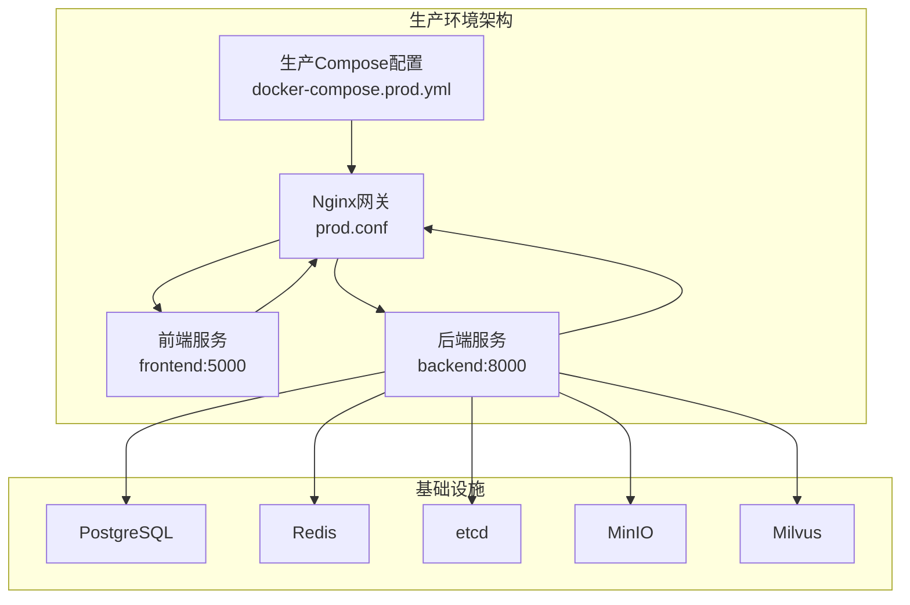
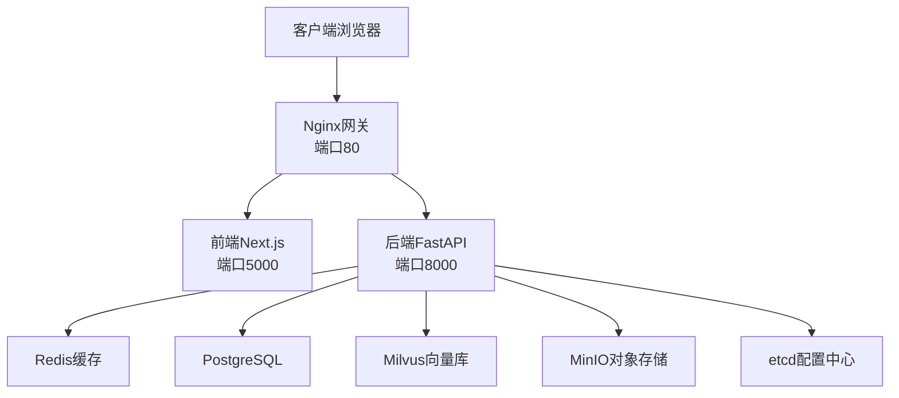
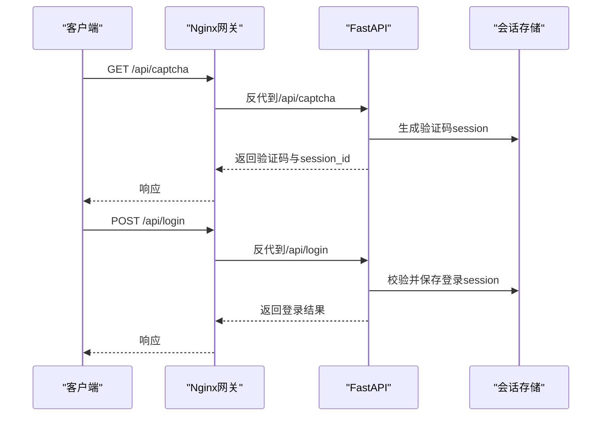
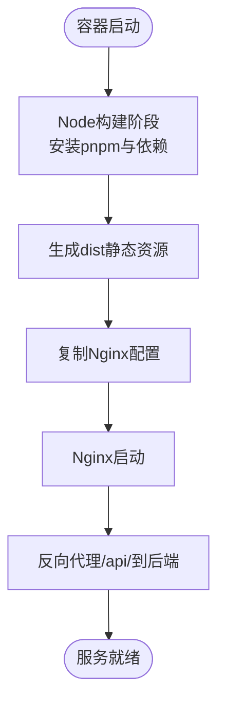
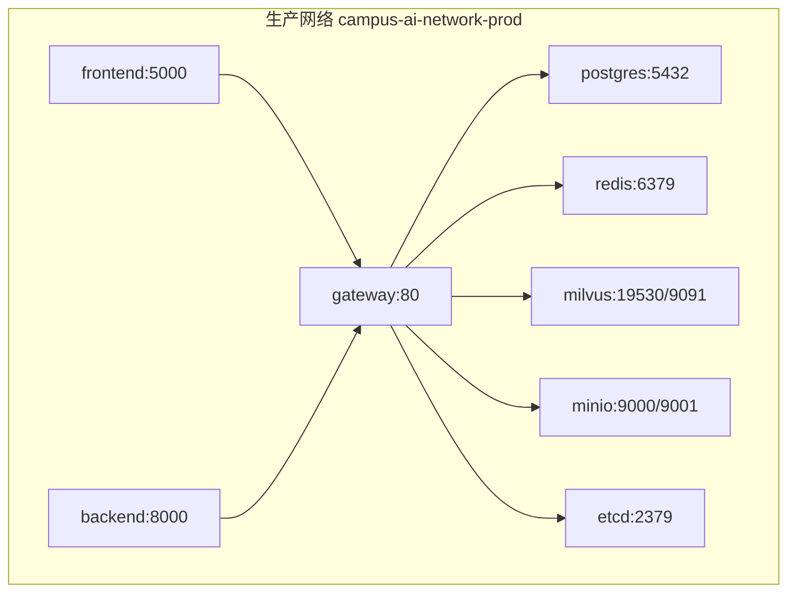
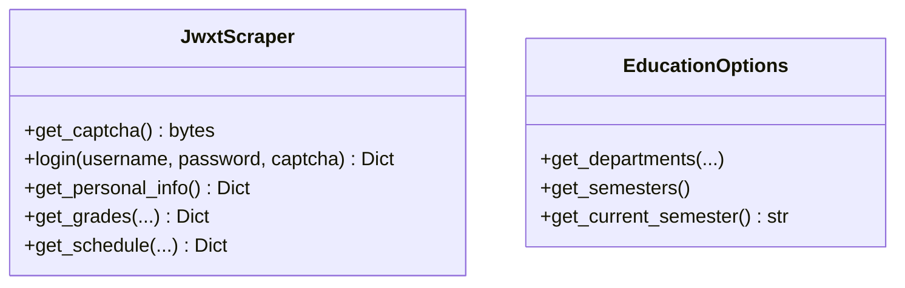
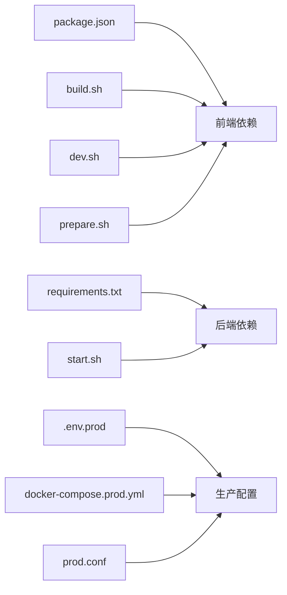

# 部署与运维

<cite>
**本文引用的文件**   
- [docker-compose.prod.yml](file://docker-compose.prod.yml)
- [deploy/nginx/prod.conf](file://deploy/nginx/prod.conf)
- [deploy/README.prod.md](file://deploy/README.prod.md)
- [docker-compose.yml](file://docker-compose.yml)
- [backend/Dockerfile](file://backend/Dockerfile)
- [frontend/Dockerfile](file://frontend/Dockerfile)
- [backend/main.py](file://backend/main.py)
- [backend/requirements.txt](file://backend/requirements.txt)
- [frontend/nginx.conf](file://frontend/nginx.conf)
- [package.json](file://package.json)
- [scripts/build.sh](file://scripts/build.sh)
- [scripts/start.sh](file://scripts/start.sh)
- [scripts/dev.sh](file://scripts/dev.sh)
- [scripts/prepare.sh](file://scripts/prepare.sh)
- [backend/scraper.py](file://backend/scraper.py)
- [backend/education_options.py](file://backend/education_options.py)
- [README.md](file://README.md)
</cite>

## 更新摘要
**变更内容**   
- 新增生产环境部署配置与说明文档
- 引入专用的生产级Docker Compose配置
- 添加Nginx生产环境反向代理配置
- 实现SSE流式输出支持的网关架构
- 提供完整的生产部署流程指导

## 目录
1. [简介](#简介)
2. [项目结构](#项目结构)
3. [核心组件](#核心组件)
4. [架构总览](#架构总览)
5. [详细组件分析](#详细组件分析)
6. [生产环境部署](#生产环境部署)
7. [依赖分析](#依赖分析)
8. [性能考虑](#性能考虑)
9. [故障排查指南](#故障排查指南)
10. [结论](#结论)
11. [附录](#附录)

## 简介
本文件面向智能教务系统AI助手的部署与运维团队，提供从容器化到生产上线、从监控日志到高可用与安全加固的完整方案。系统采用前后端分离架构，后端基于FastAPI，前端基于Next.js，通过Docker Compose进行多服务编排，包含PostgreSQL、Redis、etcd、MinIO与Milvus等基础设施，满足开发、测试与生产的多场景需求。

**更新** 新增生产环境部署配置，提供专用的生产级Docker Compose配置和Nginx网关代理，支持SSE流式输出和完整的生产部署流程。

## 项目结构
项目采用分层与功能模块化组织：
- 后端：Python + FastAPI，提供教务系统登录、验证码、数据爬取与AI相关接口
- 前端：Next.js + TypeScript，提供登录页、仪表盘与UI组件
- 基础设施：通过Docker Compose编排数据库、缓存、对象存储与向量数据库
- 运维脚本：提供构建、启动与开发调试脚本
- 生产配置：新增专用的生产环境配置文件和部署说明



**图表来源**
- [docker-compose.prod.yml:1-134](file://docker-compose.prod.yml#L1-L134)
- [deploy/nginx/prod.conf:1-51](file://deploy/nginx/prod.conf#L1-L51)

**章节来源**
- [README.md:25-41](file://README.md#L25-L41)
- [docker-compose.yml:1-148](file://docker-compose.yml#L1-L148)
- [docker-compose.prod.yml:1-134](file://docker-compose.prod.yml#L1-L134)

## 核心组件
- 健康检查与依赖编排：Compose为各服务定义健康检查与启动顺序，确保后端仅在数据库、缓存、对象存储与向量数据库就绪后再启动
- 反向代理与跨域：前端Nginx将/api前缀转发至后端，后端启用CORS中间件
- 镜像构建：后端使用Python Slim镜像，前端使用Node构建、Nginx运行的两阶段构建
- 环境变量：后端通过环境变量配置数据库、缓存、向量库、AI模型与CORS白名单等
- **新增** 网关代理：生产环境使用Nginx作为统一入口，支持SSE流式输出和静态资源服务

**章节来源**
- [docker-compose.yml:1-148](file://docker-compose.yml#L1-L148)
- [frontend/nginx.conf:12-23](file://frontend/nginx.conf#L12-L23)
- [backend/main.py:41-48](file://backend/main.py#L41-L48)
- [backend/Dockerfile:1-18](file://backend/Dockerfile#L1-L18)
- [frontend/Dockerfile:1-33](file://frontend/Dockerfile#L1-L33)
- [docker-compose.prod.yml:111-122](file://docker-compose.prod.yml#L111-L122)
- [deploy/nginx/prod.conf:1-51](file://deploy/nginx/prod.conf#L1-L51)

## 架构总览
系统采用"前端Nginx + 后端FastAPI + 多基础设施"的微服务化架构。生产环境通过专用的Nginx网关统一对外提供服务，支持SSE流式输出和静态资源服务，后端提供REST API；后端依赖Redis缓存、PostgreSQL持久化、Milvus向量检索、MinIO对象存储与etcd配置/元数据。



**图表来源**
- [docker-compose.prod.yml:111-122](file://docker-compose.prod.yml#L111-L122)
- [deploy/nginx/prod.conf:9-49](file://deploy/nginx/prod.conf#L9-L49)
- [backend/main.py:113-129](file://backend/main.py#L113-L129)

## 详细组件分析

### 后端服务（FastAPI）
- 服务职责：提供验证码、登录、个人信息、成绩、课表、教师/课程查询、AI选项查询等接口；内置健康检查端点
- 关键特性：CORS中间件、会话管理、服务器选择逻辑、日志记录
- 依赖管理：通过requirements.txt集中声明，Dockerfile中使用国内镜像源加速安装
- 启动方式：Dockerfile中以uvicorn运行，暴露8000端口



**图表来源**
- [deploy/nginx/prod.conf:30-38](file://deploy/nginx/prod.conf#L30-L38)
- [backend/main.py:135-328](file://backend/main.py#L135-L328)

**章节来源**
- [backend/main.py:95-129](file://backend/main.py#L95-L129)
- [backend/main.py:135-328](file://backend/main.py#L135-L328)
- [backend/Dockerfile:1-18](file://backend/Dockerfile#L1-L18)
- [backend/requirements.txt:1-51](file://backend/requirements.txt#L1-L51)

### 前端服务（Next.js + Nginx）
- 构建流程：Node构建阶段安装pnpm与依赖，执行构建；运行阶段使用Nginx提供静态资源与反向代理
- 反向代理：将/api前缀转发至后端服务，同时保留Host、X-Real-IP、X-Forwarded-For等头部
- 端口：容器内监听5000，Compose映射到主机端口
- **新增** 生产配置：使用专用的prod.conf配置，支持SSE流式输出和静态资源服务



**图表来源**
- [frontend/Dockerfile:1-21](file://frontend/Dockerfile#L1-L21)
- [deploy/nginx/prod.conf:40-48](file://deploy/nginx/prod.conf#L40-L48)

**章节来源**
- [frontend/Dockerfile:1-21](file://frontend/Dockerfile#L1-L21)
- [frontend/nginx.conf:1-31](file://frontend/nginx.conf#L1-L31)
- [package.json:1-92](file://package.json#L1-L92)
- [deploy/nginx/prod.conf:1-51](file://deploy/nginx/prod.conf#L1-L51)

### 基础设施编排（Compose）
- 数据持久化：PostgreSQL、Redis、etcd、MinIO、Milvus均挂载命名卷，避免容器删除导致数据丢失
- 健康检查：各服务定义健康检查命令与间隔，Compose据此判定服务状态
- 服务依赖：后端依赖数据库、缓存、向量库健康；前端依赖后端可用
- 网络：自定义bridge网络，服务间通过服务名互通
- **新增** 生产网络：使用专用的`campus-ai-network-prod`网络，避免与开发环境冲突



**图表来源**
- [docker-compose.prod.yml:130-133](file://docker-compose.prod.yml#L130-L133)
- [docker-compose.prod.yml:111-122](file://docker-compose.prod.yml#L111-L122)

**章节来源**
- [docker-compose.yml:1-148](file://docker-compose.yml#L1-L148)
- [docker-compose.prod.yml:1-134](file://docker-compose.prod.yml#L1-L134)

### 数据爬取与AI选项工具
- 爬虫模块：封装JwxtScraper类，负责验证码、登录、个人信息、成绩、课表等数据抓取
- AI选项工具：EducationOptions提供院系、学期、课程性质、修读类别等静态选项查询



**图表来源**
- [backend/scraper.py:13-200](file://backend/scraper.py#L13-L200)
- [backend/education_options.py:130-200](file://backend/education_options.py#L130-L200)

**章节来源**
- [backend/scraper.py:1-200](file://backend/scraper.py#L1-L200)
- [backend/education_options.py:1-200](file://backend/education_options.py#L1-L200)

## 生产环境部署

### 生产Compose配置详解
生产环境使用专用的`docker-compose.prod.yml`配置文件，提供以下特性：
- **专用网络**：使用`campus-ai-network-prod`避免与开发环境冲突
- **容器命名**：每个服务都有明确的生产命名规范
- **健康检查**：为所有基础设施服务配置健康检查
- **数据持久化**：所有关键数据都挂载到命名卷
- **环境变量**：通过`.env.prod`文件管理敏感配置

**章节来源**
- [docker-compose.prod.yml:1-134](file://docker-compose.prod.yml#L1-L134)

### Nginx生产配置
生产环境的Nginx配置位于`deploy/nginx/prod.conf`，提供以下功能：
- **SSE流式支持**：针对`/api/chat/send-stream`路径禁用缓冲，支持稳定的流式输出
- **统一入口**：所有请求统一通过80端口进入
- **静态资源服务**：前端静态资源由Nginx直接提供
- **反向代理**：将/api前缀转发到后端服务
- **头部传递**：保留必要的HTTP头部信息

**章节来源**
- [deploy/nginx/prod.conf:1-51](file://deploy/nginx/prod.conf#L1-L51)

### 生产部署流程
按照`deploy/README.prod.md`中的指导进行部署：

1. **准备环境变量**
   - 在项目根目录创建`.env.prod`文件
   - 包含数据库、AI模型、JWT密钥等必要配置

2. **启动生产栈**
   ```bash
   docker compose --env-file .env.prod -f docker-compose.prod.yml up -d --build
   ```

3. **验证部署**
   ```bash
   curl -i http://127.0.0.1/api/health
   docker compose -f docker-compose.prod.yml logs -f gateway backend frontend
   ```

**章节来源**
- [deploy/README.prod.md:1-36](file://deploy/README.prod.md#L1-L36)

## 依赖分析
- 前端依赖：Next.js、React、TailwindCSS、AWS SDK、Drizzle ORM等，通过package.json统一管理
- 后端依赖：FastAPI、Uvicorn、Requests、BeautifulSoup、Selenium、LangChain、OpenAI、DashScope、Redis、Milvus等
- 运维脚本：build.sh、start.sh、dev.sh、prepare.sh分别覆盖构建、打包、开发调试与依赖准备
- **新增** 生产配置：专用的环境变量管理和部署脚本



**图表来源**
- [package.json:1-92](file://package.json#L1-L92)
- [backend/requirements.txt:1-51](file://backend/requirements.txt#L1-L51)
- [scripts/build.sh:1-18](file://scripts/build.sh#L1-L18)
- [scripts/dev.sh:1-35](file://scripts/dev.sh#L1-L35)
- [scripts/prepare.sh:1-10](file://scripts/prepare.sh#L1-L10)
- [scripts/start.sh:1-18](file://scripts/start.sh#L1-L18)
- [deploy/README.prod.md:4-15](file://deploy/README.prod.md#L4-L15)
- [docker-compose.prod.yml:75-89](file://docker-compose.prod.yml#L75-L89)

**章节来源**
- [package.json:1-92](file://package.json#L1-L92)
- [backend/requirements.txt:1-51](file://backend/requirements.txt#L1-L51)
- [scripts/build.sh:1-18](file://scripts/build.sh#L1-L18)
- [scripts/dev.sh:1-35](file://scripts/dev.sh#L1-L35)
- [scripts/prepare.sh:1-10](file://scripts/prepare.sh#L1-L10)
- [scripts/start.sh:1-18](file://scripts/start.sh#L1-L18)
- [deploy/README.prod.md:4-15](file://deploy/README.prod.md#L4-L15)

## 性能考虑
- 启动与并发：后端使用uvicorn标准变体，建议在生产环境中结合Gunicorn或uvicorn作为WSGI服务器，并配置合适的worker数量与进程模型
- 缓存策略：后端已引入Redis依赖，建议在登录态、验证码、查询结果等热点数据上启用缓存，降低对上游教务系统的压力
- 爬虫性能：爬取过程涉及HTTP请求与HTML解析，建议增加超时与重试、限流与去重策略，避免触发教务系统风控
- 向量检索：Milvus作为向量数据库，建议在索引类型、分区与副本方面进行调优，结合业务查询模式选择合适metric与top_k
- 前端静态化：Nginx提供静态资源与反代，建议开启gzip压缩与缓存头，减少带宽占用
- **新增** SSE性能：生产环境的Nginx配置已针对SSE流式输出进行了专门优化，禁用缓冲以确保流式输出的稳定性

[本节为通用性能建议，不直接分析具体文件，故无"章节来源"]

## 故障排查指南
- 健康检查失败
  - PostgreSQL/Redis/Milvus/MinIO/etcd任一服务健康检查失败时，Compose不会启动后端。请检查对应服务的日志与端口映射
  - 参考：[docker-compose.yml:14-18](file://docker-compose.yml#L14-L18), [docker-compose.yml:29-33](file://docker-compose.yml#L29-L33), [docker-compose.yml:47-51](file://docker-compose.yml#L47-L51), [docker-compose.yml:66-70](file://docker-compose.yml#L66-L70), [docker-compose.yml:88-92](file://docker-compose.yml#L88-L92)
- 登录与验证码问题
  - 验证码接口返回失败或会话过期：确认前端已正确接收并传递captcha_session_id，后端会话存储是否清理及时
  - 登录失败：检查用户名、密码、验证码是否正确，服务器选择逻辑是否命中
  - 参考：[backend/main.py:135-190](file://backend/main.py#L135-L190), [backend/main.py:192-328](file://backend/main.py#L192-L328)
- CORS与跨域
  - 生产环境需收紧CORS白名单，避免使用通配符
  - 参考：[backend/main.py:41-48](file://backend/main.py#L41-L48)
- 前端无法访问后端
  - 检查Nginx反向代理配置与/api路径映射，确认后端端口与容器网络
  - 参考：[frontend/nginx.conf:12-23](file://frontend/nginx.conf#L12-L23), [docker-compose.yml:102-103](file://docker-compose.yml#L102-L103)
- **新增** 生产环境部署问题
  - 网关无法访问：检查Nginx配置文件路径映射和端口绑定
  - SSE流式输出失败：确认Nginx配置中SSE路径的缓冲禁用设置
  - 环境变量错误：验证.env.prod文件中的配置项是否正确
  - 参考：[deploy/nginx/prod.conf:15-28](file://deploy/nginx/prod.conf#L15-L28), [deploy/README.prod.md:17-28](file://deploy/README.prod.md#L17-L28)

**章节来源**
- [docker-compose.yml:14-18](file://docker-compose.yml#L14-L18)
- [docker-compose.yml:29-33](file://docker-compose.yml#L29-L33)
- [docker-compose.yml:47-51](file://docker-compose.yml#L47-L51)
- [docker-compose.yml:66-70](file://docker-compose.yml#L66-L70)
- [docker-compose.yml:88-92](file://docker-compose.yml#L88-L92)
- [backend/main.py:135-190](file://backend/main.py#L135-L190)
- [backend/main.py:192-328](file://backend/main.py#L192-L328)
- [frontend/nginx.conf:12-23](file://frontend/nginx.conf#L12-L23)
- [deploy/nginx/prod.conf:15-28](file://deploy/nginx/prod.conf#L15-L28)
- [deploy/README.prod.md:17-28](file://deploy/README.prod.md#L17-L28)

## 结论
本方案提供了从容器化到生产部署的全链路能力：Compose编排、健康检查、反向代理、镜像构建与依赖管理。新增的生产环境配置进一步完善了部署能力，包括专用的网关代理、SSE流式输出支持和完整的部署流程。建议在生产环境中进一步完善监控与日志、安全加固、高可用与灾备策略，并持续优化缓存与向量检索性能，以保障系统的稳定性与扩展性。

[本节为总结性内容，不直接分析具体文件，故无"章节来源"]

## 附录

### A. Docker容器化部署流程
- 镜像构建
  - 后端：基于Python 3.11 Slim，安装requirements.txt中的依赖，暴露8000端口
  - 前端：Node构建阶段安装pnpm与依赖并执行构建，运行阶段使用Nginx提供静态资源与反向代理
  - 参考：[backend/Dockerfile:1-18](file://backend/Dockerfile#L1-L18), [frontend/Dockerfile:1-21](file://frontend/Dockerfile#L1-L21)
- 容器编排
  - 使用docker-compose定义服务、环境变量、健康检查与依赖顺序
  - 参考：[docker-compose.yml:1-148](file://docker-compose.yml#L1-L148), [docker-compose.prod.yml:1-134](file://docker-compose.prod.yml#L1-L134)
- 服务启动与健康检查
  - 后端在数据库、缓存、向量库健康后启动；前端在后端可用后启动
  - 参考：[docker-compose.yml:130-136](file://docker-compose.yml#L130-L136), [docker-compose.prod.yml:90-96](file://docker-compose.prod.yml#L90-L96)

**章节来源**
- [backend/Dockerfile:1-18](file://backend/Dockerfile#L1-L18)
- [frontend/Dockerfile:1-21](file://frontend/Dockerfile#L1-L21)
- [docker-compose.yml:1-148](file://docker-compose.yml#L1-L148)
- [docker-compose.prod.yml:1-134](file://docker-compose.prod.yml#L1-L134)

### B. 监控与日志管理
- 应用监控
  - 后端：利用FastAPI内置指标与第三方Prometheus适配器（建议），采集请求耗时、速率与错误率
  - 基础设施：为PostgreSQL、Redis、Milvus、MinIO、etcd分别配置监控面板与告警规则
- 日志管理
  - 建议统一输出到stdout/stderr，结合Docker日志驱动或集中式日志平台（如ELK/Fluentd/Loki）
  - 后端已配置基础日志级别，建议在生产环境调整为INFO或更严格级别
  - **新增** 生产环境：Nginx日志可配置为访问日志和错误日志分离，便于问题排查
  - 参考：[backend/main.py:35-37](file://backend/main.py#L35-L37), [deploy/nginx/prod.conf:9-49](file://deploy/nginx/prod.conf#L9-L49)

**章节来源**
- [backend/main.py:35-37](file://backend/main.py#L35-L37)
- [deploy/nginx/prod.conf:9-49](file://deploy/nginx/prod.conf#L9-L49)

### C. 负载均衡与高可用
- 负载均衡：在Compose之上可接入外部LB（如Nginx/Traefik/K8s Ingress），实现多实例横向扩展
- 高可用：数据库与缓存建议使用主从/哨兵/集群模式；对象存储与向量库建议启用副本与快照
- 服务发现：在容器编排层面通过服务名即可发现；在Kubernetes环境下可使用Service与DNS
- **新增** 生产环境：Nginx网关可作为第一级负载均衡器，支持SSL终止和静态资源缓存

[本节为通用运维建议，不直接分析具体文件，故无"章节来源"]

### D. 数据库备份与恢复
- PostgreSQL
  - 备份：使用pg_dump/逻辑备份，结合定时任务与对象存储归档
  - 恢复：在新实例中导入备份，验证数据一致性
- Milvus
  - 备份：使用etcd快照与Milvus数据目录快照；恢复时注意元数据与数据一致性
- Redis
  - 备份：启用AOF/RDB持久化；定期导出RDB文件并归档
- MinIO
  - 备份：启用版本化与跨区域复制；定期校验对象完整性

[本节为通用运维建议，不直接分析具体文件，故无"章节来源"]

### E. 安全加固
- 网络安全
  - 限制CORS白名单，关闭通配符；启用HTTPS与TLS终止
  - 参考：[backend/main.py:41-48](file://backend/main.py#L41-L48)
- 访问控制
  - 后端环境变量中JWT密钥与AI模型密钥需妥善保管，使用Secret管理
  - **新增** 生产环境：使用.env.prod文件管理敏感配置，避免硬编码
  - 参考：[docker-compose.prod.yml:75-89](file://docker-compose.prod.yml#L75-L89), [deploy/README.prod.md:4-15](file://deploy/README.prod.md#L4-L15)
- 数据加密
  - 传输加密：启用TLS；静态加密：对敏感文件与备份进行加密
- 最小权限
  - 各服务使用最小权限账户运行，避免root；网络隔离使用独立子网

**章节来源**
- [backend/main.py:41-48](file://backend/main.py#L41-L48)
- [docker-compose.prod.yml:75-89](file://docker-compose.prod.yml#L75-L89)
- [deploy/README.prod.md:4-15](file://deploy/README.prod.md#L4-L15)

### F. 性能调优清单
- 后端
  - 启动参数：调整uvicorn workers与协议；启用GZip与静态文件缓存
  - 缓存：对高频查询结果启用Redis缓存
- 数据库
  - 连接池：合理设置最大连接数与空闲连接
  - 索引：为常用查询字段建立索引
- 向量库
  - 索引类型与metric选择；批量插入与查询批大小
- 前端
  - 启用Gzip与缓存头；CDN加速静态资源
- **新增** 生产环境
  - Nginx：启用gzip压缩、静态资源缓存、SSL优化
  - SSE：禁用缓冲确保流式输出稳定性
  - 参考：[deploy/nginx/prod.conf:13-28](file://deploy/nginx/prod.conf#L13-L28)

[本节为通用性能建议，不直接分析具体文件，故无"章节来源"]

### G. 运维脚本说明
- 构建脚本：安装依赖、Next.js构建、打包服务端
  - 参考：[scripts/build.sh:1-18](file://scripts/build.sh#L1-L18)
- 开发脚本：清理端口、热更新启动
  - 参考：[scripts/dev.sh:1-35](file://scripts/dev.sh#L1-L35)
- 准备脚本：安装前端依赖
  - 参考：[scripts/prepare.sh:1-10](file://scripts/prepare.sh#L1-L10)
- 启动脚本：启动打包后的服务端
  - 参考：[scripts/start.sh:1-18](file://scripts/start.sh#L1-L18)
- **新增** 生产部署脚本
  - 使用docker-compose.prod.yml进行生产部署
  - 通过.env.prod文件管理环境变量
  - 参考：[deploy/README.prod.md:17-28](file://deploy/README.prod.md#L17-L28)

**章节来源**
- [scripts/build.sh:1-18](file://scripts/build.sh#L1-L18)
- [scripts/dev.sh:1-35](file://scripts/dev.sh#L1-L35)
- [scripts/prepare.sh:1-10](file://scripts/prepare.sh#L1-L10)
- [scripts/start.sh:1-18](file://scripts/start.sh#L1-L18)
- [deploy/README.prod.md:17-28](file://deploy/README.prod.md#L17-L28)

### H. 生产环境部署最佳实践
- 环境分离：开发、测试、生产环境使用不同的Compose配置文件
- 配置管理：敏感配置放入.env.prod文件，避免提交到版本控制系统
- 监控告警：为所有服务配置健康检查和日志监控
- 备份策略：制定定期备份计划，测试恢复流程
- 安全审计：定期审查CORS配置、访问日志和错误日志
- 性能优化：根据实际流量调整Nginx和后端服务的资源配置

**章节来源**
- [deploy/README.prod.md:1-36](file://deploy/README.prod.md#L1-L36)
- [docker-compose.prod.yml:1-134](file://docker-compose.prod.yml#L1-L134)
- [deploy/nginx/prod.conf:1-51](file://deploy/nginx/prod.conf#L1-L51)