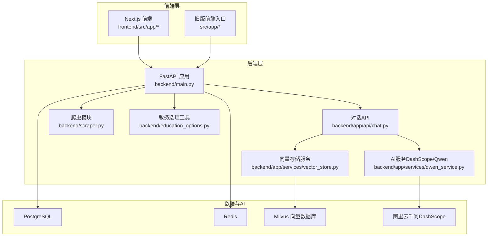
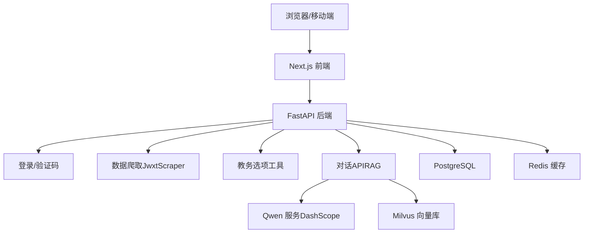
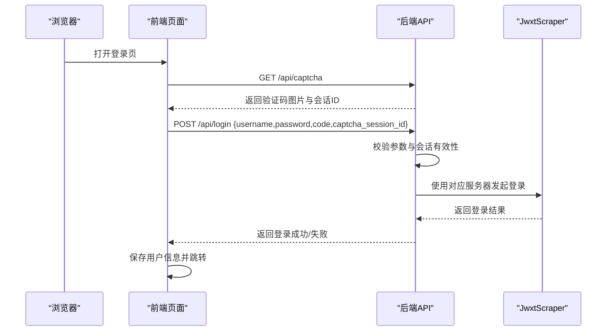
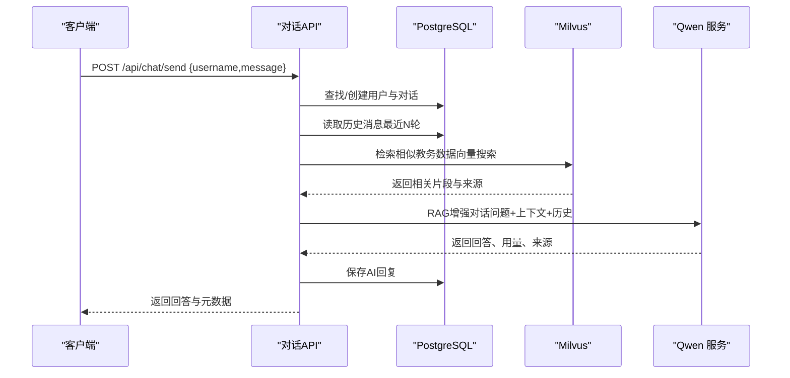
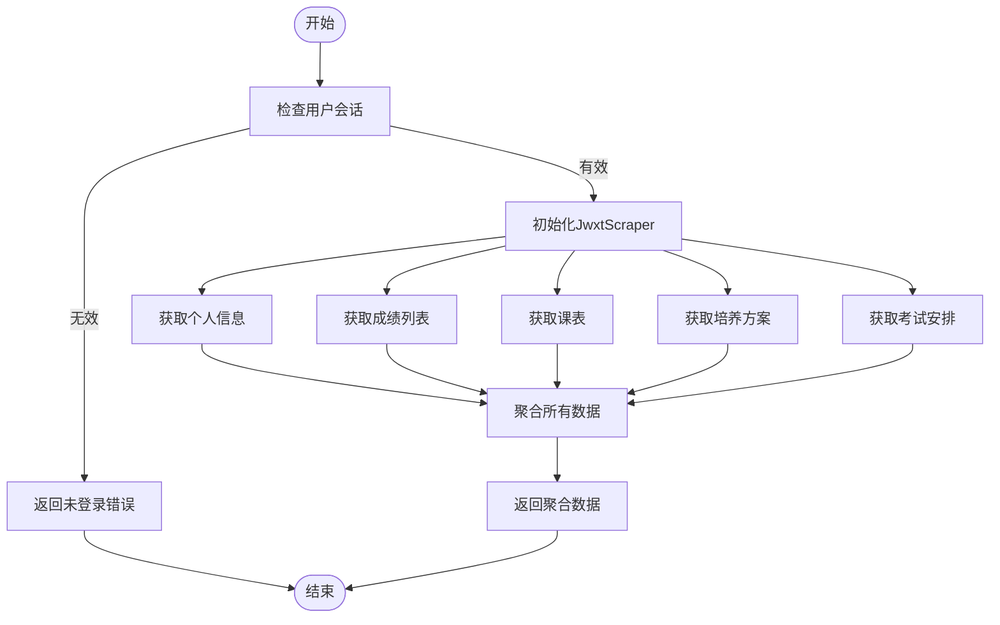
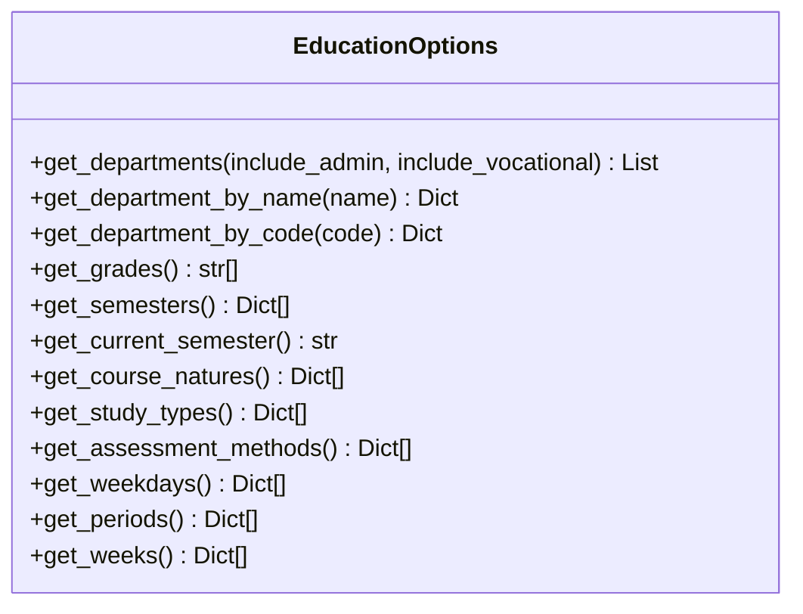
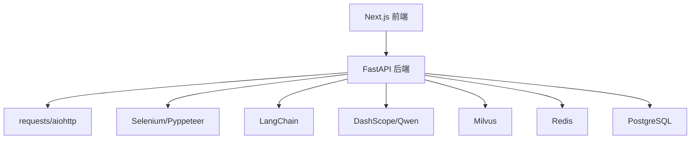

# 项目概述

<cite>
**本文档引用的文件**
- [README-Windows.md](file://README-Windows.md)
- [package.json](file://package.json)
- [backend/main.py](file://backend/main.py)
- [backend/requirements.txt](file://backend/requirements.txt)
- [backend/scraper.py](file://backend/scraper.py)
- [backend/app/api/chat.py](file://backend/app/api/chat.py)
- [backend/app/services/vector_store.py](file://backend/app/services/vector_store.py)
- [backend/app/services/qwen_service.py](file://backend/app/services/qwen_service.py)
- [backend/education_options.py](file://backend/education_options.py)
- [docker-compose.yml](file://docker-compose.yml)
- [frontend/src/app/layout.tsx](file://frontend/src/app/layout.tsx)
- [frontend/src/app/page.tsx](file://frontend/src/app/page.tsx)
- [src/app/page.tsx](file://src/app/page.tsx)
- [backend/test_login.py](file://backend/test_login.py)
</cite>

## 目录
1. [简介](#简介)
2. [项目结构](#项目结构)
3. [核心组件](#核心组件)
4. [架构总览](#架构总览)
5. [详细组件分析](#详细组件分析)
6. [依赖关系分析](#依赖关系分析)
7. [性能考虑](#性能考虑)
8. [故障排查指南](#故障排查指南)
9. [结论](#结论)
10. [附录](#附录)

## 简介
本项目是一个面向高校场景的“智能教务系统AI助手”，旨在通过现代化全栈技术栈，为学生提供一体化的教务查询与智能问答体验。项目以Next.js作为前端框架，FastAPI作为后端服务，结合LangChain生态与Milvus向量数据库，构建出具备验证码自动登录、AI智能问答、RAG检索增强等能力的智能化教务助手。

项目的主要目标包括：
- 提供稳定可靠的验证码自动登录流程，降低人工输入成本
- 基于真实教务系统的爬取数据，实现成绩、课表、培养方案、考试安排等多维度查询
- 通过RAG检索增强，将用户问题与个人教务数据结合，提供更精准的AI回答
- 采用容器化编排，简化开发与部署流程，提升可维护性与扩展性

## 项目结构
项目采用前后端分离架构，配合容器化编排，形成“前端应用 + 后端API + AI/数据服务 + 数据库/向量库”的完整链路。核心目录与职责如下：
- frontend：Next.js前端应用，负责用户界面与交互（登录页、聊天页等）
- backend：FastAPI后端，提供教务系统登录、数据爬取、AI对话、RAG检索等接口
- src：旧版前端入口（与frontend并存，后续可迁移）
- scripts/docker-compose：容器化编排，统一启动数据库、缓存、向量库与服务

**图表来源**
- [docker-compose.yml:1-148](file://docker-compose.yml#L1-L148)
- [backend/main.py:1-853](file://backend/main.py#L1-L853)
- [backend/app/api/chat.py:1-224](file://backend/app/api/chat.py#L1-L224)
- [backend/scraper.py:1-1220](file://backend/scraper.py#L1-L1220)
- [backend/app/services/vector_store.py:1-164](file://backend/app/services/vector_store.py#L1-L164)
- [backend/app/services/qwen_service.py:1-178](file://backend/app/services/qwen_service.py#L1-L178)
- [backend/education_options.py:1-420](file://backend/education_options.py#L1-L420)

**章节来源**
- [README-Windows.md:213-228](file://README-Windows.md#L213-L228)
- [docker-compose.yml:1-148](file://docker-compose.yml#L1-L148)

## 核心组件
- 前端（Next.js）
  - 登录页：支持验证码获取与提交，登录成功后跳转至聊天页
  - 聊天页：与后端对话API交互，展示AI回答与引用来源
- 后端（FastAPI）
  - 登录与验证码：提供验证码图片获取与登录接口，支持多服务器选择与会话管理
  - 数据爬取：封装JwxtScraper，实现个人信息、成绩、课表、培养方案、考试安排等查询
  - AI对话与RAG：集成Qwen服务与Milvus向量检索，实现带上下文的智能问答
  - 教务选项：提供院系、学期、课程性质等选项查询，辅助AI工具调用
- 数据与AI
  - 向量存储：基于Milvus的集合管理、向量插入与相似度检索
  - AI服务：基于DashScope的千问模型，支持普通对话与RAG增强对话
  - 选项工具：集中管理教务系统常用选项，供AI工具调用

**章节来源**
- [frontend/src/app/page.tsx:1-28](file://frontend/src/app/page.tsx#L1-L28)
- [src/app/page.tsx:1-186](file://src/app/page.tsx#L1-L186)
- [backend/main.py:1-853](file://backend/main.py#L1-L853)
- [backend/scraper.py:1-1220](file://backend/scraper.py#L1-L1220)
- [backend/app/api/chat.py:1-224](file://backend/app/api/chat.py#L1-L224)
- [backend/app/services/vector_store.py:1-164](file://backend/app/services/vector_store.py#L1-L164)
- [backend/app/services/qwen_service.py:1-178](file://backend/app/services/qwen_service.py#L1-L178)
- [backend/education_options.py:1-420](file://backend/education_options.py#L1-L420)

## 架构总览
系统采用分层架构，前后端通过REST API通信；后端内部进一步细分为业务逻辑层、数据爬取层、AI服务层与持久化层。容器编排确保数据库、缓存与向量库的高可用与可扩展。

**图表来源**
- [backend/main.py:1-853](file://backend/main.py#L1-L853)
- [backend/app/api/chat.py:1-224](file://backend/app/api/chat.py#L1-L224)
- [backend/app/services/qwen_service.py:1-178](file://backend/app/services/qwen_service.py#L1-L178)
- [backend/app/services/vector_store.py:1-164](file://backend/app/services/vector_store.py#L1-L164)
- [docker-compose.yml:1-148](file://docker-compose.yml#L1-L148)

## 详细组件分析

### 组件A：验证码自动登录与会话管理
- 功能要点
  - 前端触发后端获取验证码接口，返回base64图片与临时会话ID
  - 登录接口接收用户名、密码、验证码与会话ID，校验后返回JSESSIONID并保存会话
  - 通过学号选择服务器，保证验证码与登录在同一服务器，提升成功率
- 处理流程

**图表来源**
- [backend/main.py:135-328](file://backend/main.py#L135-L328)
- [backend/scraper.py:1-200](file://backend/scraper.py#L1-L200)
- [src/app/page.tsx:1-186](file://src/app/page.tsx#L1-L186)

**章节来源**
- [backend/main.py:135-328](file://backend/main.py#L135-L328)
- [backend/scraper.py:1-200](file://backend/scraper.py#L1-L200)
- [src/app/page.tsx:1-186](file://src/app/page.tsx#L1-L186)

### 组件B：AI智能问答与RAG检索
- 功能要点
  - 对话API支持创建对话、保存消息、检索历史、RAG增强回答
  - 当用户拥有个人教务数据时，系统生成问题向量并在Milvus中检索相似片段
  - 结合历史对话与检索上下文，调用Qwen生成最终回答，并返回引用来源与用量
- 处理流程

**图表来源**
- [backend/app/api/chat.py:45-154](file://backend/app/api/chat.py#L45-L154)
- [backend/app/services/vector_store.py:100-142](file://backend/app/services/vector_store.py#L100-L142)
- [backend/app/services/qwen_service.py:91-142](file://backend/app/services/qwen_service.py#L91-L142)

**章节来源**
- [backend/app/api/chat.py:1-224](file://backend/app/api/chat.py#L1-L224)
- [backend/app/services/vector_store.py:1-164](file://backend/app/services/vector_store.py#L1-L164)
- [backend/app/services/qwen_service.py:1-178](file://backend/app/services/qwen_service.py#L1-L178)

### 组件C：教务数据爬取与聚合
- 功能要点
  - JwxtScraper封装登录、验证码、个人信息、学籍卡片、成绩、课表、培养方案、考试安排等爬取逻辑
  - 提供统一的“聚合接口”将多种数据打包，便于向量化与RAG入库
- 处理流程

**图表来源**
- [backend/scraper.py:1-1220](file://backend/scraper.py#L1-L1220)
- [backend/main.py:698-725](file://backend/main.py#L698-L725)

**章节来源**
- [backend/scraper.py:1-1220](file://backend/scraper.py#L1-L1220)
- [backend/main.py:698-725](file://backend/main.py#L698-L725)

### 组件D：教务选项工具（AI工具）
- 功能要点
  - 提供院系、学期、课程性质、修读类别、成绩显示方式、考核方式、星期与节次、周次等选项查询
  - 支持按关键词过滤与组合查询，为AI工具提供结构化数据支撑
- 数据模型

**图表来源**
- [backend/education_options.py:130-200](file://backend/education_options.py#L130-L200)

**章节来源**
- [backend/education_options.py:1-420](file://backend/education_options.py#L1-L420)

## 依赖关系分析
- 技术栈选择与协同
  - Next.js：提供现代化前端开发体验与SSR/CSR混合渲染
  - FastAPI：高性能异步Web框架，适合API密集型后端
  - Selenium/BeautifulSoup4：用于模拟浏览器与解析HTML，实现教务系统数据爬取
  - LangChain/DashScope：提供LLM能力与RAG增强
  - Milvus：向量数据库，支撑RAG检索
  - Redis：缓存与会话存储（替代品）
  - PostgreSQL：关系型数据存储（用户、对话、消息、教育数据）
- 容器化编排
  - docker-compose统一管理PostgreSQL、Redis、Etcd、MinIO、Milvus与前后端服务，便于开发与部署

**图表来源**
- [package.json:1-92](file://package.json#L1-L92)
- [backend/requirements.txt:1-44](file://backend/requirements.txt#L1-L44)
- [docker-compose.yml:1-148](file://docker-compose.yml#L1-L148)

**章节来源**
- [package.json:1-92](file://package.json#L1-L92)
- [backend/requirements.txt:1-44](file://backend/requirements.txt#L1-L44)
- [docker-compose.yml:1-148](file://docker-compose.yml#L1-L148)

## 性能考虑
- 网络与超时
  - 登录与爬取接口设置合理超时，避免阻塞；建议在生产环境根据网络状况调整
- 向量检索优化
  - Milvus索引类型与nprobe参数影响检索速度与精度，建议结合数据规模与查询频次调优
- 缓存策略
  - 使用Redis缓存验证码会话与常用选项，减少重复请求
- 并发与异步
  - FastAPI支持异步，建议在I/O密集场景（爬虫、外部HTTP请求）充分利用异步能力

## 故障排查指南
- 常见问题
  - 验证码无法显示：检查VPN/校园网连通性，确认验证码接口可达
  - 登录失败：核对用户名、密码与验证码；查看后端日志中的响应内容与URL特征
  - Milvus连接失败：确认容器健康状态与端口映射
  - AI服务异常：检查Qwen API密钥与模型配置
- 调试建议
  - 使用测试脚本验证登录流程与服务器连通性
  - 查看后端日志输出，定位具体错误位置

**章节来源**
- [README-Windows.md:232-291](file://README-Windows.md#L232-L291)
- [backend/test_login.py:1-152](file://backend/test_login.py#L1-L152)

## 结论
本项目通过Next.js与FastAPI的组合，结合LangChain与Milvus，构建了面向高校场景的智能教务助手。其创新点在于将“验证码自动登录”“真实数据爬取”“RAG检索增强”“AI智能问答”有机结合，既满足初学者快速上手的需求，也为有经验的开发者提供了可扩展的技术架构与容器化部署方案。

## 附录
- 快速启动
  - 前端：进入frontend目录，安装依赖并启动Next.js开发服务器
  - 后端：进入backend目录，安装依赖并启动FastAPI服务
  - 容器：使用docker-compose一键启动数据库、缓存与向量库
- 开发技巧
  - 建议在开发环境中开启日志，便于定位问题
  - 对外暴露的API需在生产环境限制CORS与端口

**章节来源**
- [README-Windows.md:294-350](file://README-Windows.md#L294-L350)
- [docker-compose.yml:94-137](file://docker-compose.yml#L94-L137)